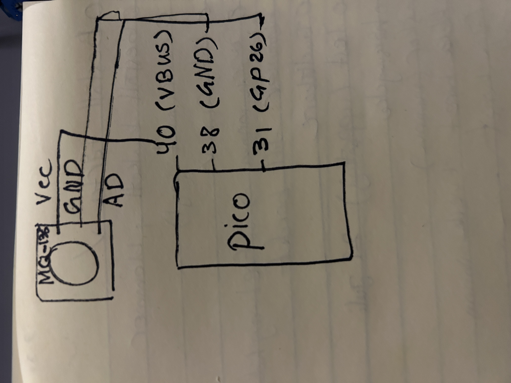
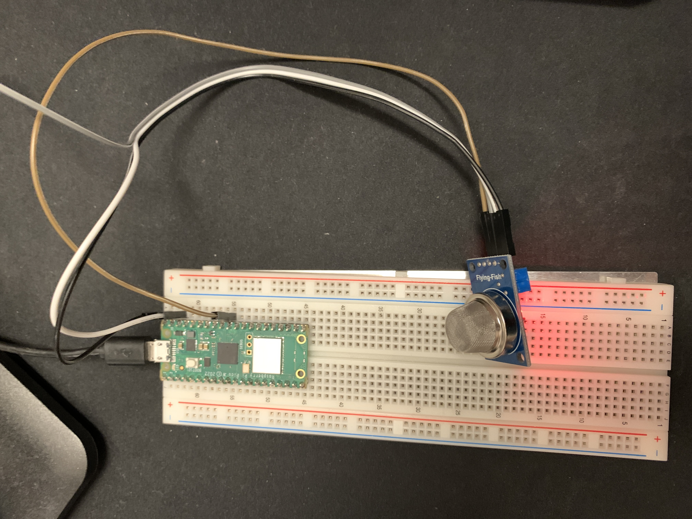
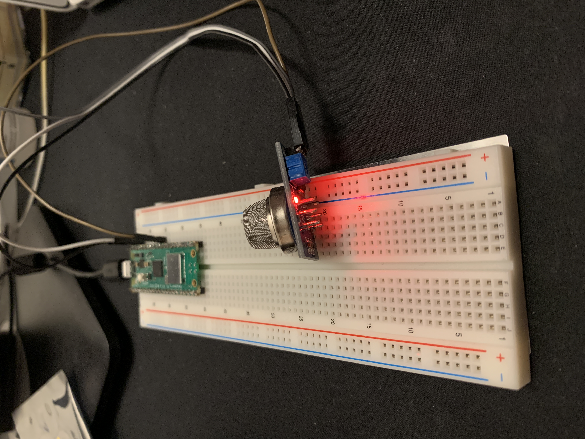
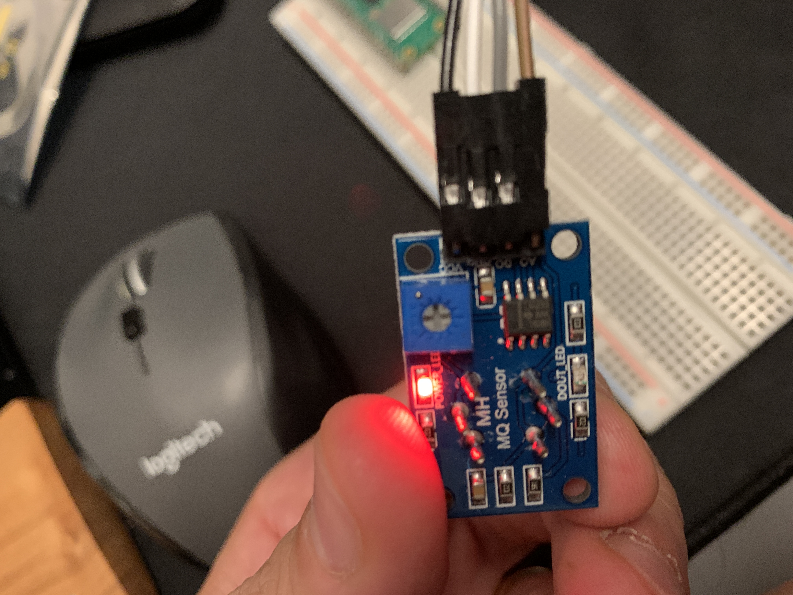
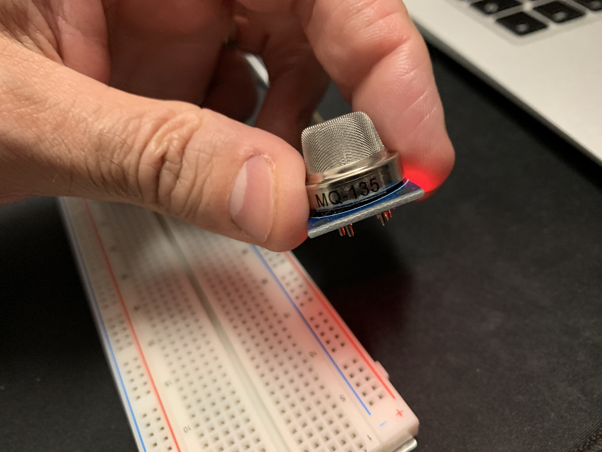
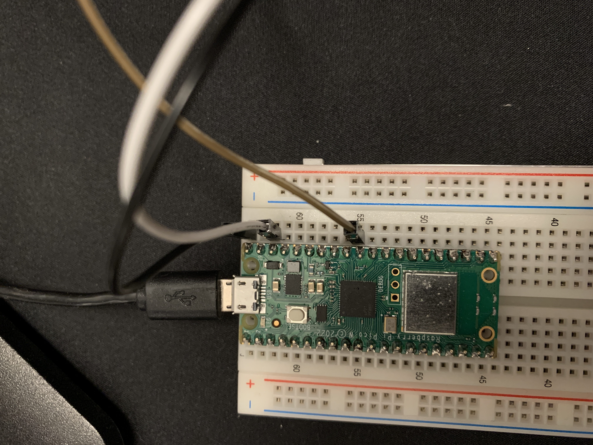

# Tutorial on how to build an air quality monitoring System with Raspberry Pi Pico W

> Nick Kushkbaghi - nk222su

---

## Short project overview

How much time it might take to do (approximation)?

        About 28 hours

| Task          | Day 1 | Day 2 | Day 3 | Day 4 |
| ------------- | ----- | ----- | ----- | ----- |
| Analysis      | 2     | 0     | 0     | 0     |
| Development   | 0     | 0     | 8     | 10    |
| Verification  | 0     | 0     | 0     | 3     |
| Documentation | 0     | 1     | 1     | 3     |
| Total         | 2     | 1     | 9     | 16    |

## Objective

The objective of this project is to create an Air Quality Monitoring System using the MQ135 sensor and Raspberry Pi Pico W. The motivation behind this project is the increasing concern for environmental health and the need for easily accessible and understandable air quality data.

## Why You Chose the Project?

This project was chosen due to a concern for the quality of the air we breathe. The air can be made dirty and harmful to our health by many factors. However, gaining knowledge about what's in the air can be challenging and costly. Therefore, a decision was made to create a method that is both easy and inexpensive to check the air. This project is ideal for anyone wishing to gain more insight into the air around them.

## What Purpose Does It Serve?

This device can be a starting point for anyone interested in understanding the air quality around them. It provides basic, real-time data about air quality that can be viewed from anywhere. While it's a simple setup, it can be used at home to get a sense of the air you're breathing. It could also be a useful tool for students learning about the environment, or for anyone curious about air quality in their area. While it's not as comprehensive as professional systems, it's a step towards making air quality monitoring more accessible.

## What Insights You Think It Will Give?

This device can give basic information about the air around us. For instance, it might help detect if there's a gas leak in the house by showing a sudden change in air quality. It could also show if the air quality gets worse at certain times, like during rush hour when there are more cars on the road. This simple device won't give professional-level data, but it can help us become more aware of changes in our immediate environment.

## Materials

| Device               | Quantity | Description                                                        | Price/ Link                                                                                                  |
| -------------------- | -------- | ------------------------------------------------------------------ | ------------------------------------------------------------------------------------------------------------ |
| Breadboard           | 1        | Serves as a base for connecting electronic components in a circuit | €7,42 [Breadboard](https://eu.robotshop.com/products/830-tie-point-interlocking-solderless-breadboard-osepp) |
| Micro USB cable      | 1        | Power source & for uploading MicroPython script to the board       | €10.18 [cable](https://www.kjell.com/se/produkter/kablar-kontakter/usb-kablar/micro-usb-kabel-1-m-p68687)    |
| MQ135                | 1        | Gas sensor                                                         | €6,79 [MQ135](https://eu.robotshop.com/products/mq-135-gas-sensor)                                           |
| Raspberry Pi Pico WH | 1        | The microcontroller board                                          | €10 [Raspberry Pi Pico](https://www.electrokit.com/produkt/raspberry-pi-pico-wh/)                            |
| Jumper Wires         | 4        | Making connections between the Raspberry Pi and the sensor         | €5 [wires](https://www.electrokit.com/produkt/labbsladd-40-pin-30cm-hane-hane/)                              |
| Total                |          |                                                                    | €39.39                                                                                                       |

## Computer setup

#### The IDE used in this project is Visual Studio Code (VS Code) and is being developed on a macOS operating system.

### Thonny

For this project, Thonny has been used. Thonny is a Python Integrated Development Environment (IDE). Thonny is available for Windows, macOS, and Linux. In this case, it has been installed on macOS using Homebrew.
Following steps shows how to install the Thonny:

1.  Open the Terminal app on your Mac.
2.  Install Homebrew by running the following command in the Terminal:

        /bin/bash -c "$(curl -fsSL https://raw.githubusercontent.com/Homebrew/install/HEAD/install.sh)"

3.  Once Homebrew is installed, run the following command to install Thonny:

        brew install --cask thonny

4.  After that you can write the following command in the terminal:

        thonny --version

5.  In Thonny, the following steps should be done:

## Computer setup:

1. Connect your Raspberry Pi Pico W to your computer by holding the button on the hardware until you see the device appear as a drive on your machine.
2. Download [Raspberry Pi Pico W with Wi-Fi support](https://micropython.org/download/rp2-pico-w/rp2-pico-w-latest.uf2) firmware file.
3. Paste the downloaded firmware file onto the Raspberry Pi Pico W drive. This will initiate the flashing process.
4. Disconnect and reconnect the Raspberry Pi Pico W hardware to ensure the firmware is properly installed.
5. Install dependencies and packages by Thonny tools/Manager Packages

## Putting everything together:

In this project, the MQ-135 gas sensor has been connected to the Raspberry Pi Pico. The MQ-135 sensor has four pins: VCC, GND, DO, and AO. The AO pin has been used be using to get readings from the sensor.

Here's how to connect everything:

VCC: Connect the VCC pin on the MQ-135 sensor to the VBUS or VSYS pin on the Raspberry Pi Pico. This provides power to the sensor. The MQ-135 sensor operates at 5V, which is the voltage provided by the VBUS or VSYS pin.

GND: Connect the GND (ground) pin on the MQ-135 sensor to a GND pin on the Raspberry Pi Pico. This completes the power circuit for the sensor.

 AO: Connect the AO pin on the MQ-135 sensor to one of the ADC (analog to digital converter) pins on the Raspberry Pi Pico (GP26, GP27, GP28, or GP29). This allows the Pico to read the analog output from the sensor.

## Choice of platform:

In this project, Adafruit IO has been used as the IoT platform. Adafruit IO is a cloud-based platform that makes it easy to send and receive data from IoT devices and create dashboards to visualize this data.

Here's why [Adafruit IO ](https://io.adafruit.com/) has been chosen:

- Ease of Use: Adafruit IO has a user-friendly interface and a straightforward API, making it easy to get started with, even for beginners.

- Integration with Hardware: Adafruit IO has built-in support for a wide range of hardware, including the Raspberry Pi Pico. This makes it easy to send data from our device to the platform.

 - Data Visualization: Adafruit IO allows you to create customizable dashboards to visualize your data. You can create different types of blocks (like line charts, gauges, and maps) to display your data in various ways.

- Free Tier: Adafruit IO offers a free tier that includes up to 30 data points per minute and up to 30 days of data storage. This is sufficient for many small-scale IoT projects.

Comparison with Other Platforms

I also considered other platforms like Thingspeak and Datacake. Thingspeak is a popular choice for IoT projects and has similar features to Adafruit IO, but I found Adafruit IO's interface to be more intuitive.

## The [code](https://github.com/Kushkbaghi/iot-project/blob/main/script.py):

Importing the required modules:

- Network: Module for managing network connectivity.
- Time: Module for working with time-related operations.
- Config: A custom module that contains configuration settings/enviroment variables for the Wi-Fi connection and MQTT client.
- Umqtt.simple: Module for MQTT communication using the simple client implementation.
- Machine: Module for interacting with hardware components, such as ADC (Analog-to-Digital Converter) and pins.

connect_wifi() function:

- Activates the Wi-Fi interface (WLAN).
- Connects to the Wi-Fi network using the provided SSID and password from the config module.
- Checks the connection status repeatedly for a limited time (10 seconds), waiting for the connection to be established.
- Raises an error if the connection fails, or returns the IP address if the connection is successful.
  
connect_mqtt() function:

- Creates an MQTT client with the specified client ID (config.CLIENT_ID) and connects it to the Adafruit IO MQTT broker using the provided username, password, and port.
- Returns the MQTT client object.

publish_data() function:

- Takes the MQTT client and data as arguments.
- Constructs the MQTT topic using the Adafruit IO username and feed name from the config module.
- Publishes the data to the constructed topic using the MQTT client's publish() method.

Main code execution:

- Calls connect_wifi() to establish a Wi-Fi connection and retrieves the IP address.
- Calls connect_mqtt() to create and connect an MQTT client.
- Creates an ADC object for reading analog values from the gas sensor, using pin 26.
- Enters an infinite loop:
- Reads the analog value from the gas sensor using adc.read_u16().
- Prints the gas level value.
- Calls publish_data() to publish the gas level value to the Adafruit IO MQTT broker.
- Sleeps for 5 seconds before repeating the loop.
- Overall, the code sets up a Wi-Fi connection, establishes an MQTT connection, reads the gas level value from the sensor, and publishes it to Adafruit IO via MQTT at regular intervals.

## Transmitting the data / connectivity:

The data can be transmitted via Wi-Fi using protocols such as MQTT.
The frequency of data transmission can be configured based on your requirements.
MQTT protocol is used for efficient data transfer.

## Presenting the data:

Use a dashboard to present the temperature and humidity data.
Visualize the data with charts and graphs.
Store the data in a database for analysis and long-term preservation.

## Finalizing the design:

Showcase the final results of the project, including pictures and a video presentation.
Share your thoughts on the project, reflecting on what could have been done differently or improved.

## Security

To increase the security of  MicroPython script, created a combination of a config.py file and environment variables for storing sensitive information such as Wi-Fi credentials and MQTT authentication details.

## Transmitting the data / connectivity

### Connectivity:

- Connect Raspberry Pi Pico to Wi-Fi using provided SSID and password.
- connect_wifi() establishes Wi-Fi connection, handles reconnection attempts, and returns IP address.

### Data Transmission:

- Use MQTT protocol to transmit data to Adafruit IO platform.
- connect_mqtt() creates MQTT client, connects to Adafruit IO broker, and returns client object.
- publish_data() publishes data to Adafruit IO using MQTT client.
- Read analog value from sensor, convert to string, and publish to Adafruit IO at regular intervals.

### Overall Functionality:

- Continuously read sensor value and publish to Adafruit IO over Wi-Fi using MQTT.
- Reliable Wi-Fi connection, MQTT connection to Adafruit IO, and periodic data publishing.
 - Monitor and visualize data on Adafruit IO dashboard or access from subscribed clients.

## Presenting the data

The data from the MQ-135 sensor is presented on a dashboard in Adafruit IO. The dashboard is built using Adafruit IO's user-friendly interface, which allows you to create customizable blocks to display your data.

Here's how it works:

Creating the Dashboard: After logging into Adafruit IO, you can create a new dashboard by clicking on "Dashboards" in the menu, then "Actions" > "Create a New Dashboard".

Adding Blocks: Once the dashboard is created, you can add blocks to it by clicking on the "+" button. For this project, a line chart block is a good choice, as it can display the sensor readings over time. When creating the block, you'll need to select the feed that contains your data.

Viewing the Data: Once the block is created, it will automatically update with the latest data from your feed. You can view the dashboard at any time by logging into Adafruit IO.

As for data storage, Adafruit IO's free plan stores data for 30 days. If you need longer data retention, you'll need to upgrade to a paid plan.

## Finalizing the design

The completed project is a functional air quality monitor that provides real-time data on an easy-to-use Adafruit IO dashboard.

Reflecting on the process, the project was a success, but there were areas that could be enhanced. Due to time constraints, certain features like integrating an LED to provide immediate visual feedback on air quality levels couldn't be implemented. This could be a valuable addition for future iterations.

Overall, this project is a good starting point for anyone interested in IoT and air quality monitoring.

## Images

